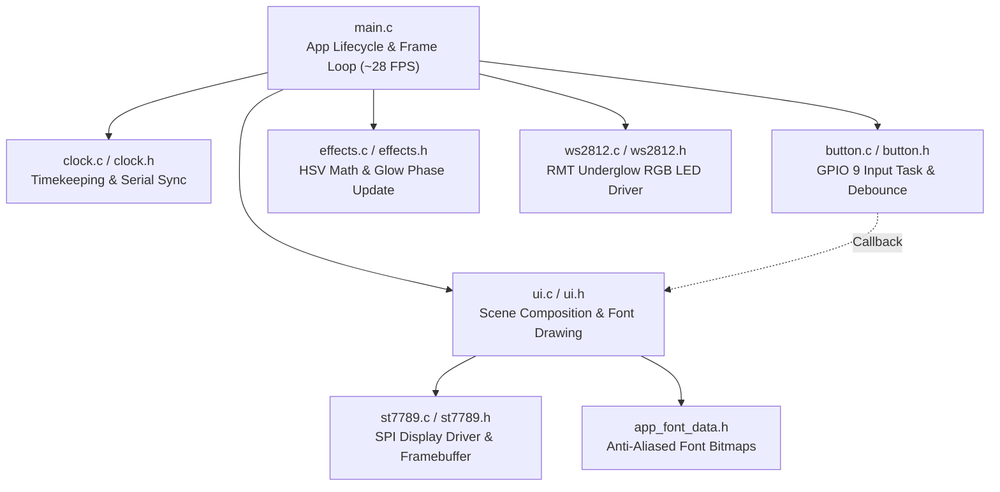

# AGENTS.md - Waveshare ESP32-C6-LCD-1.47 Project Guide

This document provides architectural context, hardware specifications, development instructions, and protocols for AI agents and developers working on this codebase.

---

## 1. Project Overview & Aesthetics

- **Application**: Real-time Digital Clock & Glowing Ambient Display.
- **Hardware Platform**: **Waveshare ESP32-C6-LCD-1.47**.
- **Display Orientation**: **Landscape (320 × 172 pixels)**.
  - User prefers **landscape orientation**.
  - Short press on the BOOT button (GPIO 9) toggles 180° rotation (`0` vs. `1`).
- **Color Theme & Contrast**: **Warm glowing text on a pure black background (`RGB(0, 0, 0)`)**.
  - Digits feature a dynamic, warm rainbow gradient (Orange $\leftrightarrow$ Red) modulated with smooth sine wave phase shifts.
  - Bottom row displays the current date in subtle 50% neutral grey (`RGB(128, 128, 128)`).
- **Ambient LED Theme**: The onboard WS2812 RGB LED shines through the acrylic casing, synchronized to the warm orange/red thermal glow of the display.

---

## 2. Hardware Specifications & Pin Mapping

| Component | Pin / Channel | Description / Notes |
| :--- | :--- | :--- |
| **Microcontroller** | ESP32-C6FH8 | 32-bit RISC-V @ 160MHz, 8MB embedded flash, Wi-Fi 6, BLE 5 |
| **LCD MOSI** | `GPIO 6` | SPI2 Data Out |
| **LCD SCLK** | `GPIO 7` | SPI2 Clock Out |
| **LCD CS** | `GPIO 14` | Chip select (active low) |
| **LCD DC** | `GPIO 15` | Data / Command control pin |
| **LCD RST** | `GPIO 21` | Hardware reset (active low) |
| **LCD Backlight** | `GPIO 22` | Digital output high / backlight enable |
| **WS2812 RGB LED** | `GPIO 8` | Addressable RGB LED driven via ESP32-C6 RMT TX peripheral |
| **BOOT Button** | `GPIO 9` | Tactile user button (active low, internal pull-up) |
| **USB Interface** | `/dev/ttyACM0` | Native USB CDC / JTAG serial unit (VID:PID `303a:1001`) |

### Display Controller Details (ST7789)
- **Native Resolution**: 172 × 320.
- **Configured Resolution (Landscape)**: **320 (W) × 172 (H)** pixels.
- **Landscape Window Configuration**:
  - `MADCTL`: `0x78` (standard landscape) or `0xA8` (180° flipped landscape).
  - **X-Offset**: **0 pixels**.
  - **Y-Offset**: **34 pixels** (`(240 - 172) / 2 = 34`). Row addresses (`RASET`) add 34.
- **Color Format**: RGB565 (16-bit, big-endian byte-swapped for SPI).
- **Color Inversion**: `INVON` (`0x21`) sent during initialization for correct IPS color reproduction.

---

## 3. Firmware Modular Architecture

The firmware is structured into modular components in `src/`:



### Source File Responsibilities

1. **`src/main.c`**:
   - Orchestrates subsystem initialization (`clock_init`, `ui_init`, `ws2812_init`, `button_init`, `clock_serial_sync_init`).
   - Runs the main loop (~28 FPS / 35 ms delay): ticks the clock, updates glow phase, drives the WS2812 LED, and triggers scene rendering.
   - Outputs status telemetry to USB serial every 5 seconds.
2. **`src/clock.h` & `src/clock.c`**:
   - Manages clock time (`s_hours`, `s_minutes`, `s_seconds`) and date string (`s_date_str`).
   - Initialized at boot from compile-time `__TIME__` and default date.
   - High-resolution tick tracking via `esp_timer_get_time()`.
   - FreeRTOS background task for ASCII serial synchronization.
3. **`src/button.h` & `src/button.c`**:
   - FreeRTOS task monitoring GPIO 9 with hardware debounce (>50 ms).
   - Dispatches registered callback on press release to toggle screen orientation.
4. **`src/effects.h` & `src/effects.c`**:
   - Standard HSV-to-RGB color space conversion.
   - Computes warm orange-to-red glow animation phase and sets character colors for the 8 digits of "HH:MM:SS" as well as the WS2812 LED.
5. **`src/ui.h` & `src/ui.c`**:
   - Scene composition: clears framebuffer, renders top row time, renders bottom row date, and flushes to display.
   - Anti-aliased font rasterization with alpha-blending onto pure black.
   - Display orientation toggle handler.
6. **`src/st7789.h` & `src/st7789.c`**:
   - Low-level SPI master driver (SPI2 @ 40 MHz) with framebuffer graphics primitives (`fb_clear`, `fb_draw_pixel`, `fb_fill_rect`, `fb_draw_string`, `st7789_flush`).
7. **`src/ws2812.h` & `src/ws2812.c`**:
   - ESP-IDF RMT TX driver generating precise 800 kHz single-wire timing symbols for the onboard WS2812 RGB LED on GPIO 8.
8. **`src/app_font_data.h`**:
   - Anti-aliased glyph bitmaps for time digits (68 px tall) and date characters (28 px tall).

---

## 4. USB Serial Synchronization Protocol

The background serial task listens on `/dev/ttyACM0` at 115200 baud for newline-terminated ASCII commands:

- **Set Time**:
  ```
  HH:MM:SS\n
  ```
  *Example*: `14:30:00\n` sets the clock to 2:30:00 PM.
- **Set Date**:
  ```
  DATE=<date_str>\n
  ```
  *Example*: `DATE=September 4, 2026\n` updates the date text.

---

## 5. Toolchain, Build, Flash & Monitor Commands

The project uses PlatformIO with the ESP-IDF framework.

### Environment Setup (`venv/` and `.pio/`)

1. **Python Virtual Environment (`venv/`)**:
   - Both `venv/` and `.pio/` are ignored by git.
   - To bootstrap a new development environment:
     ```bash
     python3 -m venv venv
     ./venv/bin/pip install -r requirements.txt
     ```
2. **Automatic Build Cache & Toolchain Provisioning (`.pio/`)**:
   - Running `./venv/bin/pio run` reads `platformio.ini` and automatically provisions `.pio/`, downloading the RISC-V cross-compiler (`toolchain-riscv32-esp`), ESP-IDF framework, CMake, and Ninja from external package registries.

### Build
```bash
./venv/bin/pio run
```

### Flash / Upload
```bash
./venv/bin/pio run -t upload
```

### Serial Monitor
```bash
./venv/bin/pio device monitor
```

---

## 6. Linux Permissions & Troubleshooting

- On Arch / systemd distributions, `/dev/ttyACM0` belongs to group `uucp` (on Debian/Ubuntu, group `dialout`).
- Permanent permission: `sudo usermod -aG uucp $USER` (requires logout/login).
- Immediate session access: `sudo chmod 666 /dev/ttyACM0`.
